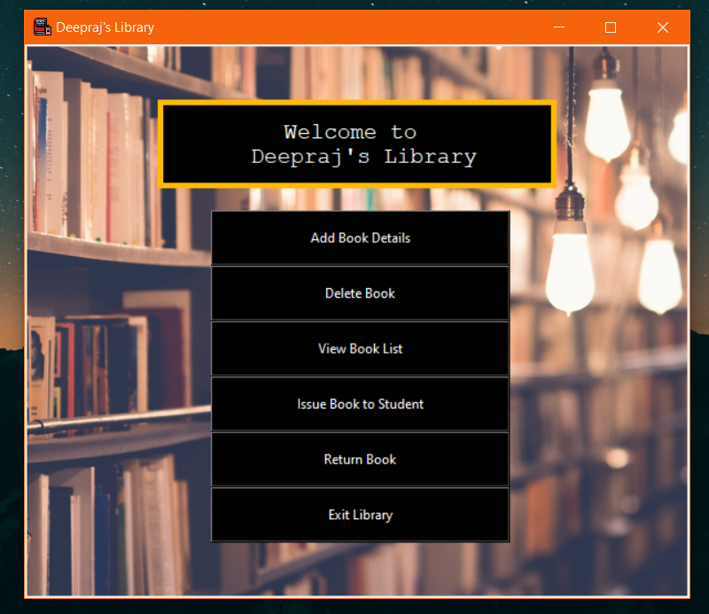

<h1 align="center">Hi 👋, I'm Deepraj Baidya</h1>
<h3 align="center">A passionate Student DEV..😎😎</h3>

 

  

# About This Project:
 

## **WELCOME  TO THE LIBRARY😋😁....**

## LIBRARY MANAGEMENT SYSTEM...
 

The library management system in python which we are going to build will look something like this.....

 

Yes, this is the library management project which I've build. Isn't it **AWESOME**

 

### <ins>**Project Prerequisits**</ins>:
 

##### 1. tkinter – Please run below command to install tkinter
        pip install tkinter
##### 2. pillow – Please run below command to install pillow
        pip install pillow
##### 3. pymysql – Please run below command to install pymysql.
        pip install pymysql

 

**Note:**
 
You are required to have MySQL server installed on your system in order to make pymysql work. If you do not have it ready, please download from [MySQL Official website](https://www.mysql.com/downloads/)

 

#### Download Project Code:
Download the project code from [Here](https://github.com/deepraj02/LibraryManagement_Database)

 

### 👻<ins>**Description of Project Files.**</ins>
Below are the project files you will get once you download and extract the Library project:

    - main.py – which does function call to all other python files

    - AddBook.py – To add the book
    
    - ViewBooks.py – To View the list of books in the library
    
    - DeleteBook.py – To Delete a book from library
    
    - IssueBook.py – To Issue a book from library
    
    - ReturnBook.py – To Return a book to the library

 

#### <ins> **Description of Tables** </ins>

#### Create Tables in MySQL:

    - create database db;

    - create table books(bid varchar(20) primary key, title varchar(30), author varchar(30), status varchar(30));

    - create table books_issued(bid varchar(20) primary key, issuedto varchar(30));

 

## About Me😁😎:

- 🔭 I’m currently working on Self Development.

- 🌱 I’m currently learning **Frameworks, Languages, Ethical Hacking Machine Learning and Android Development**

- 🤝 I’m looking for help with [PassWord-Gen_GUI](https://github.com/deepraj02/PassWord_Generator-GUI-)

- 👨‍💻 All of my projects are available at [https://sites.google.com/view/deeprajbaidya/home](https://sites.google.com/view/deeprajbaidya/home)

- 💬 Ask me about **Python, Web Development,C++**

- 📫 How to reach me **deeprajbaidya@06gmail.com**

- 📄 Know about my experiences [https://deepraj02.github.io](https://deepraj02.github.io)

- ⚡ Fun fact **I Love Coding & Playing ⚽ Football**

- 🌐 Visit My **WEBSITE** [Here](https://deepraj02.github.io)

## Social Links:

     

# **HAPPY CODING..💻**
